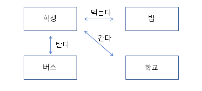

# 01. 객체와 객체 지향 프로그래밍

### 객체(Object)
* 사전적 의미 - 의사나 행위가 미치는 대상
* 구체적, 추상적 데이터의 단위 - 학생, 회원, 생산, 주문, 배송 등

### 객체 지향 프로그래밍과 절차 지향 프로그래밍
* 절차 지향 프로그래밍
  * 시간이나 사건의 흐름에 따른 프로그래밍
  * ex) 일어난다 -> 씻는다 -> 밥 먹는다 -> 버스 탄다 -> 요금 지불한다 -> 학교 도착한다.
  * 언어: C
* 객체 지향 프로그래밍
  

### 객체 지향 프로그래밍은 어떻게 구현?
* 객체 (속성) 정의
* 각 객체가 제공하는 기능 구현
* 각 객체가 제공하는 기능들 간의 소통(메세지 전달)을 통하여 객체간의 협력을 구현

### 클래스 코딩
* 클래스는 대문자로 시작
* java 파일 내에 여러 개의 클래스를 만들 수 있음
  * public class는 하나
  * public class와 .java 파일의 이름은 동일