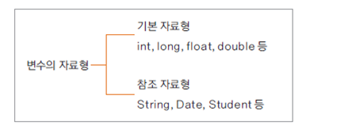
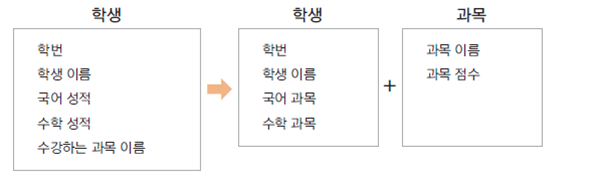

# 08. 참조 자료형 변수

### 참조 자료형
* 변수의 자료형
  
  

* 클래스형으로 변수 선언
* 기본 자료형은 사용하는 메모리의 크기가 정해져 있지만, 참조 자료형은 클래스에 따라 크기가 다름
* 참조 자료형을 사용할 때는 해당 변수에 대해 생성해야 한다.
  (String 클래스는 예외)

### 참조 자료형 정의 후 사용
* 학생이 수강한 과목들에 대한 성적을 산출하기 위한 경우 학생 클래스 속성에 과목이 모두 있으면 불합리
* 학생(school.Student)과 과목(school.Subject)에 대한 클래스를 분리하여 사용
* school.Subject 클래스를 활용하여 수강한 과목들의 변수의 타입으로 선언
  
  

* 선언된 school.Subject 변수는 생성된 인스턴스가 아니므로, Student의 생성자에서 생성하여 사용