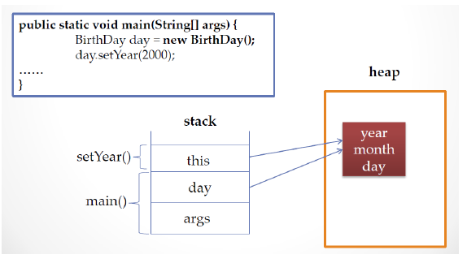

# 11. 객체 자신을 자리기키는 this

### this
* 인스턴스 자신의 메모리를 가리킴
* 생성자에서 또 다른 생성자를 호출할 때 사용
* 자신의 주소(참조값) 반환

### 생성된 인스턴스 메모리의 주소를 가짐
* 클래스 내에서 참조변수가 가지는 주소값과 동일한 주소값을 가지는 키워드
  
  

    public void setYear(int year){
        this.year = year;
    }

### 생성자에서 다른 생성자를 호출하는 this
* 클래스에서 생성자가 여러 개인 경우, this를 이용하여 생성자에서 다른 생성자를 호출할 수 있음
* 생성자에서 다른 생성자를 호출할 때 인스턴스 생성이 완전하지 않은 상태이므로 this() statement 이전에 다른 statement를 쓸 수 없음

    public class Person {
        String name;
        int age;
    
        public Person() { // 생성자 역할: 인스턴스 초기화
            this("이름없음", 1); // 다른 생성자를 호출
        }
    
        public Person(String name, int age) {
            this.name = name;
            this.age = age;
        }
    }

### 자신의 주소를 반환하는 this

    public class Person {
        String name;
        int age;
        
        public Person() {
            this("이름없음", 1);
        }
        
        public Person(String name, int age) {
            this.name = name;
            this.age = age;
        }
        
        public Person getPerson() {
            return this;
        }
        
        
        public static void main(String[] args)
        {
            Person p = new Person();
            p.name = "James";
            p.age = 37;
            
            Person p2 = p.getPerson();
            System.out.println(p);
            System.out.println(p2);
        }
    }
