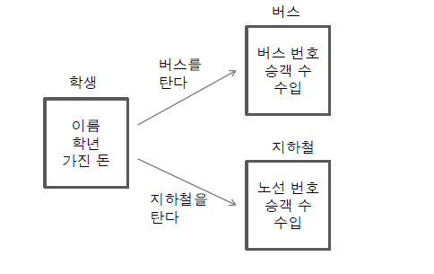

# 12. 객체 간의 협력 (collaboration)

### 객체 지향 프로그래밍에서의 협력
* 객체 지향 프로글매에서 객체 간에는 협력이 이루어짐
* 협력을 위해서는 필요한 메세지를 전송하고 이를 처리하는 기능이 구현되어야 함
* 매개 변수로 객체가 전달되는 경우가 발생
* 객체 협력의 예
  
  

#### 예시1 - 버스와 지하철을 타는 예제
* James와 Tomas는 각각 버스와 지하철을 타고 학교를 감
* James는 5000원을 가지고 있었고, 100번 버스를 타면서 1000원을 지불
* Tomas는 10000원을 가지고 있었고, 초록색 지하철를 타면서 1200원을 지불

#### 예시2 - 택시를 타는 예제
* Edward는 택시는 탄다
* Edward는 20000원 가지고 있었고, 10000원을 택시비로 사용했다
* 택시는 '잘나간다 운수' 회사 택시를 탔다