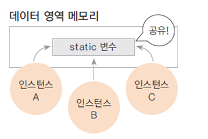
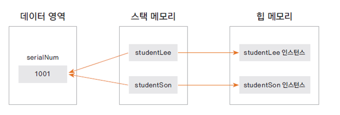

# 13. static 변수

### 여러 인스턴스에서 공통으로 사용하는 변수가 필요한 경우
* 여러 인스턴스가 공유하는 기준 값이 필요한 경우
  * 학생마다 (새로운) 학번 생성
  * 카드 회사에서 카드를 새로 발급할 때마다 (새로운) 카드 번호를 부여
  * 회사에 사원이 입사할 때마다 (새로운) 사번이 필요
  
  
  
### static 변수 선언과 사용

    static int serialNum;

* 인스턴스가 생성될 때 만들어지는 변수가 아닌, 처음 프로그램이 메모리에 로딩될 때 메모리를 할당
  * 프로그램이 메모리에 로딩될 때 크게 프로그램은 Code 영역과 Data(상수, static) 영역으로 나뉜다.
    * Code 영역: 명령어 집합인 instruction set
    * Data 영역: 처음부터 메모리에 할당되는 변수들(상수, 리터럴, static 등)
      * 이는 프로그램이 종료되고 메모리에서 언로드되면서 소멸된다.
  * 인스턴스가 생성될 때마다 할당되는 메모리는 Heap 메모리(동적 메모리, 이후 인스턴스가 사라지면 GC에 의해 해제된다.)
* 클래스 변수, 정적변수라고도 한다(vs 인스턴스 변수)
* 인스턴스 생성과 상관없이 사용가능하므로 클래스 이름으로 직접 참조

    school.Student.serialNum = 100;

* static 변수는 인스턴스 공통으로 사용하는 영역
  
  

