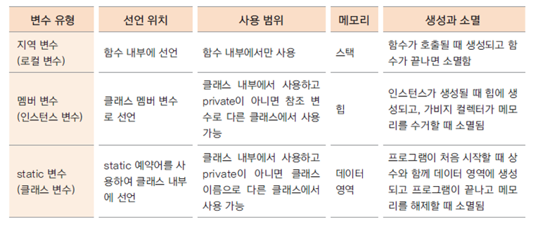

# 14. static 메서드

### static 메서드 구현
* static 변수를 private로 선언하고 getter/setter 구현
* 클레스 이름으로 호출가능 (클래스 메서드, 정적 메서드)

    Employee.getSerialNum();

### static 메서드(클래스 메서드)에는 인스턴스 변수를 사용할 수 없다.
* static 메서드는 인스턴스 생성과 무관하게 클래스 이름으로 호출될 수 있음
* 인스턴스 생성 전에 호출될 수 있으므로 static 메서드 내부에서는 인스턴스 변수를 사용할 수 없음

    public static void setSerialNum(int serialNum) {
        int i = 0; // 지역 변수
        employeeName = "Lee"; // 인스턴스 변수 -> 오류 발생
        Employee.serialNum = serialNum
    }

### 변수의 유효 범위와 메모리
* 변수의 유효 범위(scope)와 생성과 소멸(life cycle)은 각 변수의 종류마다 다름
* 지역 변수, 멤버 변수, 클래스 변수는 유효 범위와 라이프 사이클, 사용하는 메모리도 다름
  
  

* static 변수는 프로그램이 메모리에 있는 동안 계속 그 영역을 차지함  
   => 너무 큰 메모리를 할당하는 것은 좋지 않음
* 클래스 내부의 여러 메서드에서 사용하는 변수 -> 멤버 변수로 선언
* 멤버 변수가 너무 많으면? 인스턴스 생성 시 쓸데없는 메모리가 할당되기 때문에 좋지 않음
* 상황에 적절하게 변수를 사용해야 함