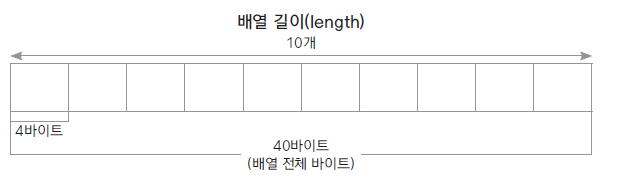
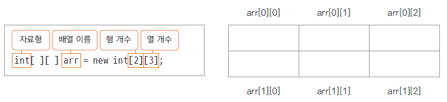

# 16. 배열 (array)

### 배열이란
* 동일한 자료형의 순차적 자료구조
* 인덱스 연산자[]를 이용하여 빠른 참조가 가능
* 물리적 위치와 논리적 위치가 동일
* 배열 순서는 0부터 시작
* 자바에서는 객체 개별을 구현한 ArrayList를 많이 이용

### 배열 선언과 초기화
* 배열 선언

    int[] arr1 = new int[10];
    int arr2[] = new int[10];

* 배열 초기화

배열은 선언과 동시에 자료형에 따라 초기화됨(정수는 0, 실수는 0.0, 객체는 null)

필요에 따라 초기값을 지정할 수 있음

    int[] numbers = new int[] {10, 20, 30}; // 개수 생략
    int[] numbers = {10, 20, 30}; // new int[]는 생략 가능
    int[] ids;
    ids = new int[] {10, 20, 30}; // 선언 후 배열을 생성하는 경우는 new int[]는 생략 불가능

### 배열 사용
* [] 인덱스 연산자 활용 - 배열 요소가 저장된 메모리의 위치를 연산하여 찾아줌

### 배열의 길이와 요소 개수는 동일하지 않음
* 배열을 선언하면 개수만큼 메모리 할당됨, 실제 요소(데이터)가 없는 경우도 있음
* 배열의 length 속성은 배열의 개수를 반환 해주기때문에 요소 개수와는 다름
* length를 활용하여 오류가 나는 경우

    double[] dArr = new double[5];
    dArr[0] = 1.1;
    dArr[1] = 2.1;
    dArr[2] = 3.1;
    
    double mtotal = 1;
    for (int i=0; i<dArr.length; i++) {
        mtotal *= dArr[i]; // 오류 발생
    }

### 다차원 배열
* 이차원 이상으로 구현된 배열
* 평면 (이차원 배열)이나 공간(삼차원 배열)을 활용한 프로그램 구현
  
  

