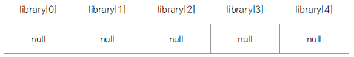

# 17. 객체 배열

### 객체 배열 선언과 구현
* 기본 자료형 배열은 선언과 동시에 배열의 크기만큼 메모리가 할당됨
* 객체 배열은 요소가 되는 객체의 주소가 들어갈(4바이트, 8바이트) 메모리만 할당되고(null) 각 요소 객체는 생성하여 저장해야 한다.
  
  

### 객체 배열 복사
* System.arrayCopy(src, srcPos, dest, destPos, length): 자바에서 제공되는 배열 복사 메서드
* 얕은 복사
  * 객체 주소만 복사되어 한쪽 배열의 요소를 수정하면 같이 수정됨
  * 두 배열이 같은 객체를 가리킴
* 깊은 복사
  * 각각의 객체를 생성하여 그 객체의 값을 복사하여 배열이 서로 다른 객체를 가리키도록 함

