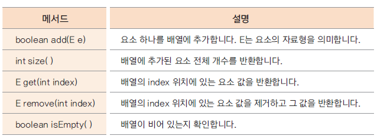

# ArrayList 클래스

# java.util 패키지에서 제공되는 ArrayList

* 기존 배열 선언과 사용 방식은 배열의 길이를 정하고 요소의 개수가 배열의 길이보다 커지면 배열을 재당할하고 복사해야하는 문제점이 있음
* 배열의 요소를 추가하거나 삭제하면 다른 요소들의 이동에 대한 구현을 해야함
* ArrayList는 객체 배열을 좀 더 효율적으로 관리하기 위해 자바에서 제공해주는 클래스
* 이미 많은 메서드들이 최적의 알고리즘으로 구현되어 있어 각 메서드의 사용 방법만 익히면 유용하게 사용할 수 있음

### ArrayList 주소 메서드

### 예시 - ArrayList를 활용한 간단한 성적 산출 프로그램

    1001학번 Lee와 1002학번 Kim, 두 학생이 있습니다. 
    Lee 학생은 국어와 수학 2과목을 수강했고, Kim 학생은 국어, 수학, 영어 3 과목을 수강하였습니다.
    Lee 학생은 국어 100점, 수학 50점입니다.
    Kim 학생은 국어 70점, 수학 85점, 영어 100점입니다.
    Student와 school.Subject 클래스를 만들고 ArrayList를 활용하여 두 학생의 과목 성적과 총점을 출력하세요