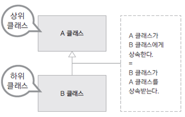
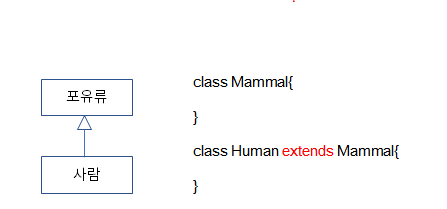

# 01. 객체 간의 상속

### 클래스 상속
* 새로운 클래스를 정의할 때 이미 구현된 클래스를 상속받아서 속성이나 기능을 확장하여 클래스를 구현함
* 이미 구현된 클래스보다 더 구체적인 기능을 가진 클래스를 구현해야 할때 기존 클래스를 상속함
  
  

* 상속 방법: extends 키워드를 사용. 뒤에는 단 하나의 클래스만 올 수 있음
   => 자바는 단일 상속만 가능

### 상속 구현
* 상위 클래스는 하위 클래스보다 더 일반적인 개념과 기능을 가짐
* 하위 클래스는 상위 클래스보다 더 구체적인 개념과 기능을 가짐
* 하위 클래스가 상위 클래스의 속성과 기능을 확장(extends)한다는 의미
  
  

### 예시

    회사에서 고객 정보를 활용한 맞춤 서비스를 하기 위해 일반고객(Customer)과
    이보다 충성도가 높은 우수고객(VIPCustomer)에 따른 서비스를 제공하고자 함

    물품을 구매할 때 적용되는 할인율과 적립되는 보너스 포인트의 비율이 다름
    여러 멤버십에 대한 각각 다양한 서비스를 제공할 수 있음
    멤버십에 대한 구현을 클래스 상속을 활용하여 구현