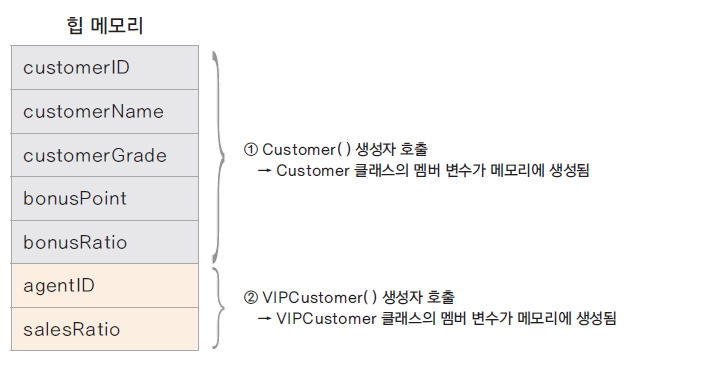
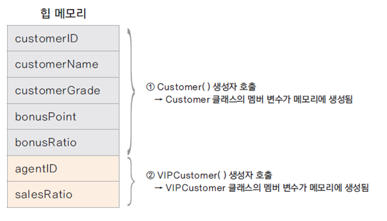
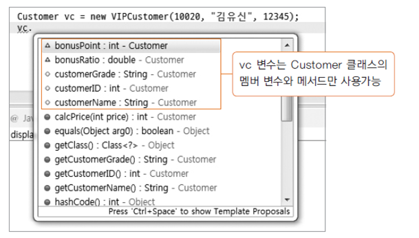
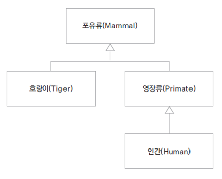

# 02. 상속에서 클래스 생성과 형 변환

### 하위 클래스가 생성되는 과정
* 하위 클래스를 생성하면 상위 클래스가 먼저 생성됨
  * ex) new VIPCustomer() 호출 시 Customer()가 먼저 호출 
    => 클래스가 상속받은 경우 하위 클래스의 생성자에서는 반드시 상위 클래스의 생성자를 호출함

### super 키워드
* 하위 클래스에서 가지는 상위 클래스에 대한 참조 값
* super()는 상위 클래스의 기본 생성자를 호출함
* 하위 클래스에서 명시적으로 상위 클래스의 생성자를 호출하지 않으면 super() 가 호출됨
   => 이때 반드시 상위 클래스의 기본 생성자가 존재해야 한다.
* 상위 클래스 기본 생성자가 없는 경우(다른 생성자가 있을 경우) 하위 클래스의 생성자에서는 super를 이용하여 명시적으로 상위 클래스의 생성자를 호출함
* super는 생성된 상위 클래스 인스턴스의 참조값을 가지므로 super를 이용하여 상위 클래스의 메서드나 멤버 변수에 접근할 수 있음

### 상속에서 인스턴스 메모리 상태
* 항상 상위 클래스의 인스턴스가 먼저 생성되고, 하위 클래스의 인스턴스가 생성됨
  
  

### 형 변환 - 업캐스팅
* 상위 클래스로 변수를 선언하고 하위 클래스의 생성자로 인스턴스를 생성

    Customer customer = new VIPCustomer();

* 상위 클래스의 타입의 변수에 하위 클래스 변수가 대입

    VIPCustomer vipCustomer = new VIPCustomer();
    addCustomer(vipVustomer);

    int addCustomer(Customer customer) {
      ...
    }

* 하위 클래스는 상위 클래스의 타입을 내포하고 있으므로 상위 클래스의 묵시적 형변환이 가능함
* 상속 관계에서 모든 하위 클래스는 상위 클래스로 형 변환(업캐스팅)이 됨 => 그 역은 성립 X

### 형 변환과 메모리
* Customer vc = new VIPCustomer(); 에서 vs가 가리키는 것은?
  * VIPCustomer() 생성자에 의해 VIPCustomer 클래스의 모든 멤버 변수에 대한 메모리를 생성되었지만,
   변수 타입이 Customer 이므로 실제 접근 가능한 변수나 메서드는 Customer의 변수와 메서드이다.
  
  
  
  

### 클래스의 계층 구조가 여러 단계인 경우

* Human은 내부적으로 Primate와 mammal의 타입을 모두 내포하고 있음

  
    Primate pHumman = new Humman();
    Mammal mHumman = new Humman();