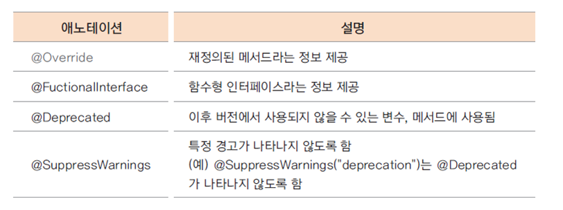

# 03. 메서드 재정의 (overriding)

### 하위 클래스에서 메서드 재정의 하기
* 오버라이딩(overriding): 상위 클래스에서 정의된 메서드의 구현 내용이 하위 클래스에서 구현할 내용과 맞지 않는 경우 하위 클래스에서 동일한 이름의 메서드를 재정의할 수 있음
  * VIPCustomer 클래스의 calcPrice()는 할인율이 적용되지 않음
   => 재정의하여 할인율이 적용되도록 구현

### @Overriding 어노테이션(annotation)
* 어노테이션이란 원래 주석이라는 의미
* 컴파일러에게 특별한 정보를 제공해주는 역할
  
  

* @overriding 어노테이션은 재정의된 메서드라는 의미로 선언부가 기존의 메서드와 다른 경우 에러가 난다.

### 형 변환과 오버라이딩 메서드 호출
<pre>
Customer vc = new VIPCustomer();
vc 변수의 타입은 Customer이지만 인스턴스의 타입은 VIPCustomer이다.
자바에서는 항상 인스턴스의 메서드가 호출된다. => 가상 메서드의 원리
자바의 모든 메서드는 가상 메서드(virtual method)이다.
</pre>