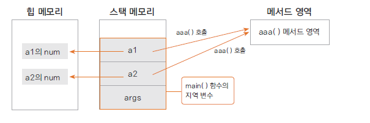
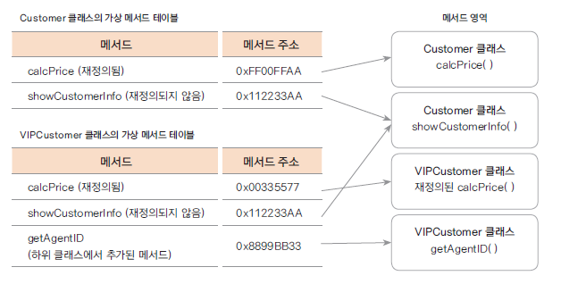
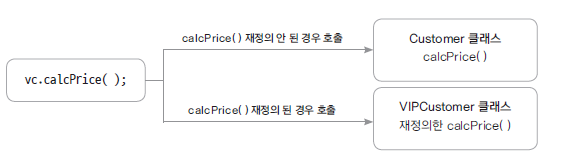

# 04. 메서드 재정의와 가상 메서드 원리

### 메서드 실행 원리
* 메서드(함수)의 이름은 주소값을 나타냄
* 메서드는 명령어의 집합이고 프로그램이 로드되면 메서드 영역(코드 영역)에 명령어 집합이 위치한다
1. 메서드 호출 시 명령어 집합이 있는 주소를 찾아 명령어가 실행된다 
2. 이때 메서드에서 사용하는 변수들은 스택 메모리에 할당됨
3. 따라서 다른 인스턴스라도 같은 메서드의 코드는 같으므로 같은 메서드가 호출됨
4. 인스턴스가 생성되면 변수는 힙 메모리에 따로 생성되지만, 메서드 명령어 집합은 처음 한번만 로드됨

    public class TestMethod {
    
        int num;
        
        void aaa() {
            System.out.println("aaa() 호출");
        }
        
        public static void main(String[] args) {
            
            TestMethod a1 = new TestMethod();
            a1.aaa();
            
            TestMethod a2 = new TestMethod();
            a2.aaa();
        }
    
    }

### 가상 메서드 원리
* 가상 메서드 테이블(virtual method table)에서 해당 메서드에 대한 address를 가지고 있음
* 재정의된 경우는 재정의된 메서드 주소를 가리킴
  
  
  
  