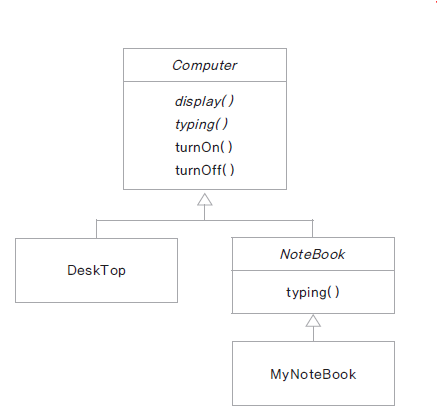

# 08. 추상클래스

### 추상클래스(abstract class)란?
* 구현 코드 없이 메서드 선언만 있는 추상 메서드를 포함한 클래스
* 메서드 선언: 반환타입, 메서드 이름, 매개변수로 구성
* 메서드 정의: 메서드 구현과 동일한 의미 구현부를 가짐
* ex
  * int add(int x, int y); // 선언
  * int add(int x, int y) {return x+y; } // 구현부가 있음, 추상 메서드 아님
* abstact 예약어 사용
* 추상 클래스는 new 할 수 없음 -> 인스턴스화 할 수 없음
* 추상 클래스를 활용하여 템플릿 메서드 패턴 구현

### 추상 클래스 구현
* 메서드에 구현 코드가 없으면 abstract로 선언
* abstract로 선언된 메서드를 가진 클래스는 abstract로 선언
* 모든 메서드가 구현된 클래스라도 abstract로 선언되면 추상 클래스로 인스턴스화할 수 없다.
* 추상 클래스의 추상 메서드는 하위 클래스가 상속하여 구현
* 추상 클래스 내의 추상 메서드: 하위클래스가 구현해야 하는 메서드
* 추상 클래스 내의 구현된 메서드: 하위 클래스가 공통으로 사용하는 메서드(필요에 의해 하위 클래스에서 재정의)
  
  

