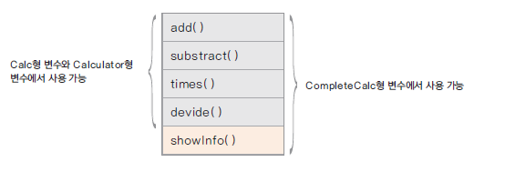

# 10. 인터페이스

### 인터페이스(interface)란?
* 모든 메서드가 추상 메서드로 선언됨 -> public abstract
* 모든 변수는 상수로 선언됨 -> public static final
* 자바 8부터 디폴트 메서드와 정적 메서드 기능의 제공으로 일부 구현 코드가 있음

### 인터페이스 구현과 형 변환
* 인터페이스를 구현한 클래스는 인터페이스 형으로 선언한 변수로 형 변환할 수 있음
  * ex) Calc calc = new CompleteCalc();
* 상속에서의 형 변환과 동일한 의미
* 클래스 상속과 달리 구현 코드가 없어 여러 인터페이스를 구현할 수 있음 (cf. extends)
* 형 변환 되는 경우 인터페이스에 선언된 메서드만 사용 가능함

### 인터페이스가 하는 일 -> 사용이유
* 클래스나 프로그램이 제공하는 기능을 명시적으로 선언
* 일종의 클라이언트 코드와의 약속이며 클래스나 프로그램이 제공하는 명세(specification)
* 클라이언트 프로그램은 인터페이스에 선언된 메서드 명세만 보고 이를 구현한 클래스를 사용할 수 있음
* 어떤 객체가 하나의 인터페이스 타입이라는 것은 그 인터페이스가 제공하는 모든 메서드를 구현했다는 의미
* 인터페이스를 구현한 다양한 객체를 사용함 -> 다형성
* 예) JDBC 인터페이스
  * 데이터베이스는 Oracle, MS-SQL, MySQL 등등이 있다.
  * 자바 프로그램과 DB에 접속하기 위해 자바에서는 Connection이라는 인터페이스를 만듬
  * 이 Connection을 DB벤더들에게 주어 구현시키도록 함
  * 벤더에서 제공해주는 driver class와 자바에서 제공하는 인터페이스가 연결이 되면 전부 인터페이스를 통해 접속할 수 있게 된다.

<pre>
자바에서는 JDBC 프로그래밍을 하기 위해서는 이 벤더에서 제공하는 클래스를 이용해야하는데,
벤더에서 제공하는 클래스가 통일되어 있지않으면 각각의 모든 데이터베이스 동작을 
알고 있어야 JDBC 프로그래밍이 가능해진다. 이를 개선하기 위해서 인터페이스를 사용하며, 
자바에서는 데이터베이스 연동을 위한 데이터베이스 관련 객체를
인터페이스와 만들어, 이 인터페이스를 가지고 벤터들이 구현 클래스를 만듬으로써 
개발자는 인터페이스가 있으면 인터페이스를 통해서 하위클래스를 핸들링할 수 있다.
</pre>