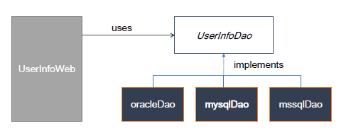
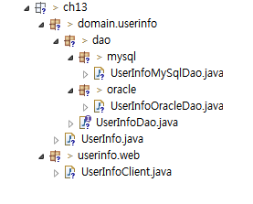

# 11. 인터페이스를 활용한 다형성 구현 - dao 구현

### 인터페이스와 다형성
* 하나의 인터페이스를 여러 객체가 구현하게 되면 클라이언트 프로그램은 인터페이스의 메서드를 활용하여 여러 객체의 구현을 사용할 수 있음
  * 다형성
* 예
  
  

### 인터페이스를 활용한 dao 구현
* DB에 회원정보를 넣는 dao(data access object)를 여러 DB 제품이 지원할 수 있게 구현함
* 환경 파일(db.properties)에서 database의 종류에 대한 정보를 읽고 그 정보에 맞게 dao 인터페이스를 생성하여 실행할 수 있게 함
* source hierarchy
  
  

