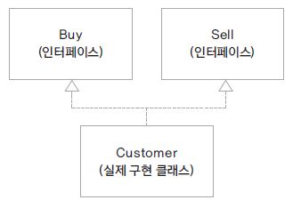
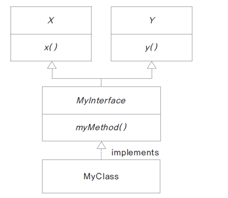
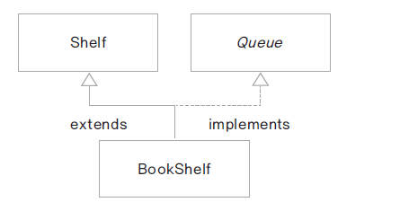

# 13. 여러 인터페이스 구현 및 상속

### 여러 인터페이스 구현
* 자바의 인터페이스는 구현 코드가 없으므로 하나의 클래스가 여러 인터페이스를 구현할 수 있음
* 디폴트 메서드가 중복되는 경우, 구현하는 클래스에서 재정의해야 함
* 여러 인터페이스를 구현한 클래스는 인터페이스 타입으로 형 변환 되는 경우 해당 인터페이스에 선언된 메서드만 사용 가능

### 디폴트 메서드가 중복되는 경우
* 구현 코드를 가지고 인터페이스 생성된 경우만 호출되는 경우 디폴트 메서드의 경우 두 개의 인터페이스에서 중복되면 구현하는 클래스에서 반드시 재정해야 함

### 인터페이스 상속
* 인터페이스 사이에도 상속 가능
* extends 키워드 사용
* 인터페이스는 다중 상속이 가능하고 구현 코드의 상속이 아니므로 타입 상속이라고 함

### 클래스 상속과 인터페이스 함께 사용
* 프레임워크나 오픈소스와 함께 연동되는 구현을 하게 되면 클래스 상속과 인터페이스 구현을 같이 사용하는 경우가 있음
  
  
  * 책이 순서대로 대여가 되는 도서관 구현
  * 책을 보관하는 자료 구조가 Shelf에 구현됨 (ArrayList)
  * Queue 인터페이스를 구현
  * Shelf 클래스를 상속받고 Queue를 구현함
