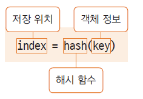

# 01. Object 클래스 - 모든 클래스의 최상위 클래스

### java.lang 패키지
* 프로그래밍 시 import 하지 않아도 자동으로 import 됨
* 많이 사용하는 기본 클래스들이 속한 패키지
* String, Integer, System ...

### 모든 클래스는 Object 클래스를 상속 받는다
* java.lang.Object 클래스
* 모든 클래스는 Object에서 상속받고, Object 클래스의 메서드 중 일부는 재정의해서 사용 가능
* 컴파일러가 extends Object를 추가함
     => class school.Student -> class school.Student extends Object

### toString() 메서드
* 객체의 정보를 String으로 바꾸어서 사용할 때 쓰임
* String이나 Integer 클래스는 이미 재정의 되어 있음
* toString() 재정의

    class Book{
    
        private String title;
        private String author;
        
        public Book(String title, String author) {
            this.title = title;
            this.author = author;
        }
        
        public String toString() {
            return title + "," + author;
        }
    
    }
    
    public class BookTest {
    
        public static void main(String[] args) {
    
            Book book = new Book("데미안", "헤르만 헤세");
            
            System.out.println(book);
        }
    }

### equals() 메서드
* 두 인스턴스의 주소값을 비교하여 true/false를 반환함
* 재정의하여 두 인스턴스가 논리적으로 동일함의 여부를 구현 가능
  * 인스턴스가 다르더라도 논리적으로 동일한 경우 true로 반환하도록 할 수 있음

### hashCode() 메서드
* hashCode()는 인스턴스의 저장 주소를 반환함
* 힙메모리에 인스턴스가 저장되는 방식이 hash 방식
* hash: 정보를 저장, 검색하는 자료구조
* 자료의 특정 값(키 값)에 대한 저장 위치를 반환해주는 해시 함수를 사용

* 두 인스턴스가 같다는 것은?
 두 인스턴스에 대한 equals()의 반환값이 true, 동일한 hashCode() 값을 반환
* 논리적으로 동일함을 위해 equals() 메서드를 재정의했다면, hashCode() 메서드도 재정의하여 동일한 hsahCode 값이 반환되도록 함

### clone() 메서드
* 객체의 원본을 복제하는 데 사용하는 메서드
* 생성과정의 복잡한 과정을 반복하지 않고 복제할 수있음
* clone() 메서드를 사용하면 객체의 정보(멤버 변수 값 등)가 동일한 또 다른 인스턴스가 생성되는 것이므로, 객체 지향 프로그래밍의 정보은닉, 객체 보호의 관점에서 위배될 수 있음
* 해당 클래스의 clone() 메서드의 사용을 허용한다는 의미로 cloneable 인터페이스를 명시해줌