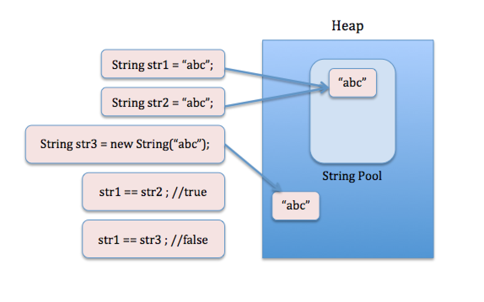

# 02. String, StringBuilder, StringBuffer 클래스, text block

### String 클래스
* String 선언

    
    String str1 = new String("abc");
    String str2 = "abc";

* 힙 메모리에 인스턴스로 생성되는 경우와 상수 풀(constant pool)에 있는 주소를 참조하는 두 가지 방법
  * 힙 메모리는 생성될 때마다 다른 주소값을 가지지만, 상수 풀의 문자열은 모두 같은 주소를 가짐
  
  

* String은 immutable(불변)이기 때문에 안전하다.
  * 여러 참조 변수가 같은 String 객체를 참조하고 있다하더라고 안전 -> String 객체를 누가 조작할 수 없기 때문
  * String 객체를 이리저리 전달할 때 원본 String 객체가 저장된 주소 자체를 넘겨도 안전함 -> 전달받은 곳에서 원반 값을 읽은 수는 있어도 조작할 수는 없기 때문
  * 안전하기 때문에 성능 및 효율 면에서 이득을 얻을 수 있음
    * ex) "java"라는 문자열을 100개의 String 변수로 만들었다해도 메모리에 100개의 "java" 문자열이 저장되는 것이 아님
        하나의 "java"라는 문자열을 넣고 100개의 참조 변수가 하나의 "java" 문자열을 참조하도록 함 => 성능과 메모리 효율성이 좋음
  * String이 mutable이라면, 100개의 참조 변수 중 하나의 참조 변수가 "java"에서 "JAVA"로 바꾸게 되면 다른 99개의 참조 변수 역시 "JAVA"를 바라보게 됨

* String이 immuatable이기 때문에 String을 연결하는 concatenate 연산을 함에 있어서 비효율적인 면이 있음
  * A 문자열에 B 문자열을 연결할 때 A에 B를 덧붙이는 것이 아닌 새로운 문자열 객체 C를 만들고 A와 B를 더한 결과 값을 담기 때문
  * 즉, 추가적인 String 객체를 만들고, A와 B의 값을 모두 복사하는 과정이 이루어짐
  * 이러한 비효율성을 막기 위해 StringBuilder나 StringBuffer를 사용

### StringBuilder, StringBuffer 사용
* 내부적으로 가변적인 char[]를 멤버 변수로 가짐
* 문자열을 여러번 연결하거나 변경할 때 사용하면 유용
* 새로운 인스턴스를 생성하지 않고 char[]를 변경함
* StringBuffer는 멀티 쓰레드 프로그래밍에서 동기화(synchronization) 보장 -> thread-safe
* 단일 쓰레드 프로그래밍에서는 StringBuilder 사용을 권장
* toString() 메서드로 String 반환

### text block (java 13)
* 문자열을 """ """ 사이에 이어서 만들 수 있음
* html, json 문자열을 만드는데 유용
