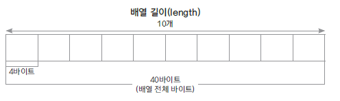

# 01. 배열(Array)

### Array의 특징
* 동일한 데이터 타입을 순서에 따라 관리하는 자료 구조
* 정해진 크기가 있음
* 요소의 추가와 제거 시 다른 요소들의 이동이 필요
* 배열의 i번째 요소를 찾는 인덱스 연산이 빠름 - 접근
* jdk 클래스: ArrayList, Vector
* 시간 복잡도

| 접근 | 검색 | 추가 | 제거 |
|----|----|---|---|
| O(1) | O(n) | O(n) | O(n) |

