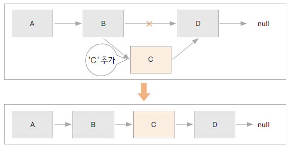
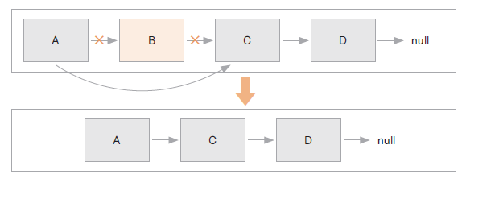

# 02. 단일 연결리스트 (LinkedList)

### 연결리스트 특징
* 동일한 데이터 타입을 순서에 따라 관리하는 자료구조
* 자료를 저장하는 노드에는 자료와 다음 요소를 가리키는 링크(포인터)가 있음
* 자료가 추가될 때 노드만큼의 메로리를 할당받고 이전 노드의 링크로 함(정해진 크기가 없음)
* 연결 리스트의 i번재 요소를 찾는 데에 걸리는 시간은 요소의 개수에 비례
* jdk 클래스: LinkedList
* 리스트에 자료 추가
  
  

* 리스트에서 자료 삭제
  
  

* 시간 복잡도

| 접근   | 검색 | 추가   | 제거   |
|------|----|------|------|
| O(n) | O(n) | O(1) | O(1) |