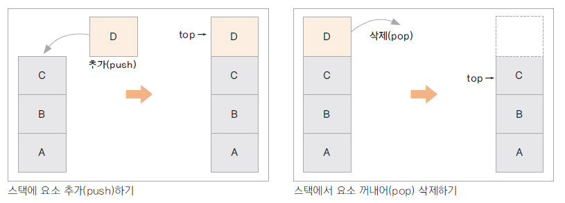

# 03. 스택

### 스택 특징
* 맨 마지막 위치(top)에서만 자료를 추가, 삭제, 꺼낼 수 있음(중간의 자료를 꺼낼 수 없다)
  * Last In First Out(LIFO, 후입선출) 구조
* 가장 최근의 자료를 찾아오거나 게임에서 히스토리를 유지하고 이를 무를 때 사용할 수 있음
* 함수의 메모리는 호출 순서에 따른 stack 구조
* jdk 클래스: stack

* 시간 복잡도

| 접근   | 검색 | 추가   | 제거   |
|------|----|------|------|
| O(n) | O(n) | O(1) | O(1) |