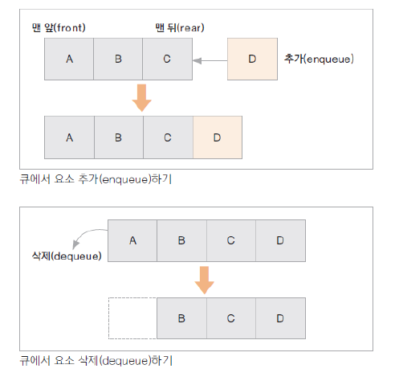

# 04. 큐(Queue)

### 큐 특징
* 맨 앞(front)에서 자료를 꺼내거나 삭제하고, 맨 뒤(rear)에서 자료를 추가함
  * First In First Out(FIFO, 선입선출) 구조
* 순차적으로 입력된 자료를 순서대로 처리하는 데 많이 사용되는 자료구조
* jdk: ArrayList
  
  

* 시간 복잡도

| 접근   | 검색 | 추가   | 제거   |
|------|----|------|------|
| O(n) | O(n) | O(1) | O(1) |
