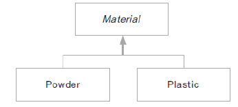

# 06. <T extends 클래스>

### 상위 클래스의 필요성
* T 자료형의 범위를 제한할 수 있음
* 상위 클래스에서 선언하거나 정의하는 메서드를 활용할 수 있음
* 상속을 받지 않는 경우 T는 Object로 변환되어 Object 클래스가 기본으로 제공하는 메서드만 사용 가능

### T extends

* GenericPrinter에 material 변수의 자료형을 상속받아 구현
* T에 무작위 클래스가 들어갈 수없게 Material 클래스를 상속받은 클래스로 한정

