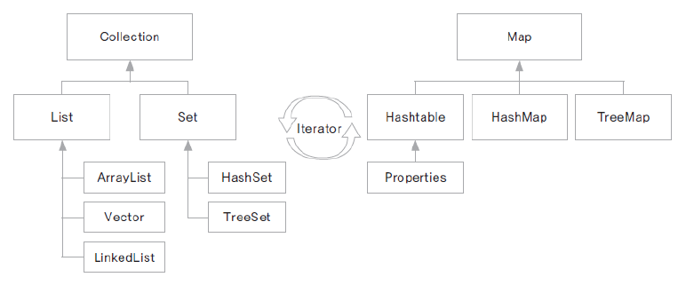

# 08. 컬렉션 프레임워크

### 컬렉션 프레임워크
* 프로그램 구현에 필요한 자료구조를 구현해 놓은 JDK 라이브러리
* java.util 패키지에 구현되어 있음
* 개발에 소요되는 시간을 절약하면서 최적화된 알고리즘을 사용할 수 있음
* 여러 구현 클래스와 인터페이스의 활용에 대한 이해가 필요

* T로 시작하는 인터페이스의 경우 정렬되어 저장되는 인터페이스이다.
  * TreeSet, TreeMap

### Collection 인터페이스
* 하나의 객체를 관리하기 위한 메서드가 선언된 인터페이스
* 하위에 List와 Set 인터페이스가 있음
    * List 인터페이스
      * 객체를 순서에 따라 저장하고 관리하는데 필요한 메서드가 선언된 인터페이스
      * 자료구조 리스트 (배열, 연결 리스트)의 구현을 위한 인터페이스
      * 중복 허용
      * ArrayList, Vector, LinkedList, Stack, Queue 등
    * Set 인터페이스
      * 순서에 상관없이 저장되며 중복을 허용하지 않음
      * 유일한 값을 관리하는데 필요한 메서드가 선언됨
      * 아이디, 주민번호, 사번 등을 관리하는데 유용
      * 저장된 순서와 출력되는 순서가 다를 수 있음
      * HashSet, TreeSet 등
        * HashSet
          * Set 인터페이스를 구현한 클래스
          * 중복 여부를 체크하기 위해 인스턴스의 동일성을 확인해야 함
          * 동일성 구현을 위해 필요에 따라 equals()와 hashCode() 메서드를 재정의

### Map 인터페이스
* 쌍(Pair)로 이루어진 객체를 관리하는 데 사용하는 메서드들이 선언된 인터페이스
* 객체는 key-value 쌍으로 이루어짐
* key는 중복을 허용하지 않음
* HashTable, HashMap, Properties, TreeMap 등
  * HashMap 클래스
    * Map 인터페이스를 구현한 클래스
    * 가장 많이 사용되는 Map 인터페이스 기반 클래스
    * 검색을 위한 자료구조
    * key를 이용하여 값을 지정하고 key를 이용하여 값을 꺼내오는 방식 - hash 알고리즘으로 구현됨
    * key가 되는 객체는 중복될 수 없고 객체의 유일성 비교를 위한 eqauls()와 hashCode() 메서드를 구현
  * TreeMap 클래스
    * Map 인터페이스를 구현한 클래스이며, Key에 대한 정렬을 구현할 수 있음
    * key가 되는 클래스에 Comparable이나 Comparator 인터페이스를 구현함으로써 key-value 쌍의 자료를 key 값 기준으로 정렬하여 관리할 수 있음

### Iterator
* Collection 요소 순회
* 요소 순회란?
  * 컬렉션 프레임워크에 저장된 요소들을 하나씩 차례로 참조하는 것
  * 순서가 있는 List 인터페이스는 Iterator를 사용하지 않고 get() 메서드를 활용할 수 있음
  * Set 인터페이스의 경우 get() 메서드가 지원되지 않으므로 Iterator를 활용하여 객체를 순회함
* Iterator 사용
  * boolean hasNext(): 이후 요소가 더 있는지를 체크하여 여부를 반환해주는 메서드, true/false
  * E next(): 다음에 있는 요소 반환

    public boolean removeMember(int memberId){  // 멤버 아이디를 매개변수로, 삭제 여부를 반환
	
		Iterator<Member> ir = arrayList.iterator();
		while(ir.hasNext()) {
			Member member = ir.next();
			int tempId = member.getMemberId();
			if(tempId == memberId){            // 멤버아이디가 매개변수와 일치하면 
				arrayList.remove(member);           // 해당 멤버를 삭제
				return true;                   // true 반환
			}
		}
		
		System.out.println(memberId + "가 존재하지 않습니다");  //for 가 끝날때 까지 return 이 안된경우
		return false;                   
    }
