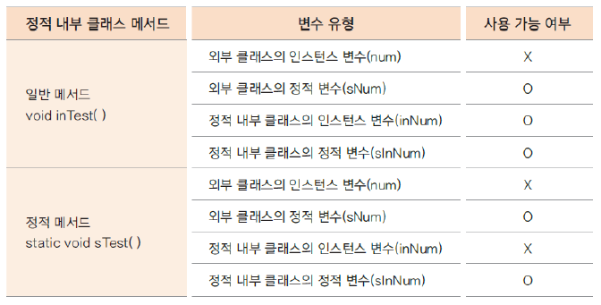

# 01. 여러 내부 클래스의 정의와 유형

### 내부 클래스(inner class)
* 클래스 내부에 선언한 클래스로 이 클래스를 감싸고 있는 외부 클래스와 밀접한 연관이 있는 경우가 많음
* 다른 외부 클래스에서 사용할 일이 거의 없는 경우에 사용
* 중첩 클래스라고도 함
* 내부 클래스 종류
  * 인스턴스 내부 클래스, 정적(static) 내부 클래스, 지역(local) 내부 클래스, 익명(anonymous) 내부 클래스

### 인스턴스 내부 클래스
* 내부적으로 사용할 클래스를 선언(private 선언 권장)
* 외부 클래스가 생성된 후 생성됨(정적 내부 클래스와 다름)
* private가 아닌 내부 클래스는 다른 외부 클래스에서 생성 가능

### 정적 내부 클래스
* 외부 클래스 생성과 무관하게 사용 가능
* 정적 변수, 정적 메서드 사용
* 정적 내부 클래스 일반 메서드와 정적 메서드에서의 변수 사용
  
  

### 지역 내부 클래스
* 지역 변수와 같이 메서드 내부에서 정의하여 사용하는 클래스
* 메서드의 호출이 끝나면 메서드에 사용된 지역변수의 유효성은 사라짐
* 메서드 호출 이후에도 사용해야하는 경우가 있을 수 있으므로 지역 내부 클래스에서 사용하는 메서드의 지역 변수나 매개변수는 final로 선언

### 익명 내부 클래스
* 이름이 없는 클래스
* 클래스의 이름을 생략하고 주로 하나의 인터페이스나 하나의 추상 클래스를 구현하여 반환
* 인터페이스나 추상 클래스 자료형의 변수에 직접 대입하여 클래스를 생성하거나 지역 내부 클래스의 메서드 내부에서 생성하여 반환할 수 있음
* 