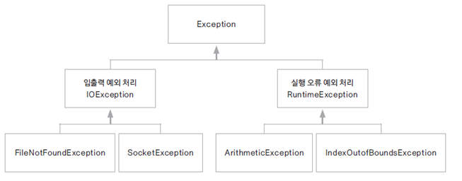
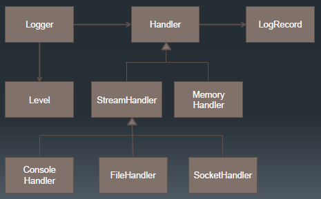

# 05. 예외 처리

### 프로그램에서의 오류
* 컴파일 오류(compile error)
  * 프로그램 작성 중 발생하는 문법적 오류
  * 최근에는 개발 환경에서 대부분의 컴파일 오류는 detection 된다.
* 실행 오류(runtime error)
  * 실행 중인 프로그램이 의도하지 않은 동작(bug)을 하거나 프로그램이 중지되는 오류
  * 실행 오류는 비정상 종료가 되는 경우 시스템의 심각한 장애를 발생할 수 있다.

### 예외 처리의 중요성
* 프로그램의 비정상 종료를 피하여 시스템이 원할하게 실행되도록 함
* 실행 오류가 발생한 경우 오류의 과정을 재현하는 것은 현실적으로 힘듬
* 오류가 발생하는 경우 log를 남겨 추후 log 분석을 통해 그 원인을 파악하여 bug를 수정하는 것이 중요

### 오류와 예외 클래스
* 시스템 오류(error): 가상 머신에서 발생, 프로그래머가 처리할 수 없는 오류
  * 동적 메모리가 없는 경우, 스택 메모리 오버 플로우 등
* 예외(exception): 프로그램에서 제어할 수 있는 오류
  * 읽어들이려는 파일이 존재하지 않거나, 네트워크나 DB 연결이 안되는 경우 등
* 자바는 안정성이 중요한 언어로 대부분 프로그램에서 발생하는 오류에 대해 문법적으로 예외 처리를 해야함

### 예외 크래스들
* 모든 예외 클래스의 최상위 클래스는 Exception 클래스이다.
* 자바에서는 다양한 예외들에 대해 그 처리를 위한 클래스가 제공되고 있다.
* 예외 클래스
  
  

  * Arithmetic Exception: 정수를 0으로 나눈 경우 발생
  * NullPointerException: 초기화 되지 않은 Object를 사용하는 경우
  * ArrayIndexOutofBoundsException: 배열의 크기를 넘어선 위치를 참조하려는 경우
  * FileNotFoundException: 참조하는 파일이 지정된 위치에 존재하지 않는 경우
  * ClassNotFoundException: 클래스가 로드되지 않는 경우
  * InterruptedException: Thread.sleep(), join(). Object의 wait()으로 non-runnable 상태인 thread를 Runnable하게 만들 수 있도록 사용할 수 있음

### 예외 처리
* try-catch 문: try 블록에는 예외가 발생할 가능성이 있는 코드 작성, 예외 발생 시 catch 블록이 수행
* try-catch-finally 문
  * finally 블럭에서 파일을 받거나 네트워크를 닫는 등의 리소스 해제 구현을 함
  * try 블럭이 수행되는 경우, finally 블록은 항상 수행됨
    * 여러 개의 예외 블럭이 있는 경우 각각 리소스를 해제하지 않고 finally 블록에서 해제.
* try-with-resources 문
  * 리소스를 사용하는 경우 close() 하지 않아도 자동으로 해제되도록 함
  * 리소스를 try 내부에서 선언
  * close()를 명시적으로 작성하지 않아도 try 블록에서 열린 리소스는 정상적인 경우나 예외가 발생한 경우 모두 자동으로 해제됨
  * 해당 리소스 클래스가 AutoCloseable 인터페이스를 구현해야 함
  * FileInputStream의 경우에는 AutoCloseable을 구현하고 있음

### 예외 처리 미루기
* 예외 처리는 예외가 발생하는 문장에서 try-catch 블록으로 처리하는 방법과 이를 사용하는 부분에서 처리하는 방법이 있음
* throws를 이용하면 예외가 발생할 수 있는 부분을 사용하는 문장에서 예외 처리를 할 수 있음
* ThrowException.java

### 오류 로그 - Logger
* logging
  * 시스템 운영에 대한 기록
  * 오류가 발생했을 때 그 오류에 대한 기록을 남겨 디버깅을 용이하게 함
  * 로그 파일에 기록하는 코드를 추가하여 필요한 정보가 로그로 남을 수 있도록 함
  * 디버깅, 시스템 에러 추적, 성능, 문제점 향상 등을 위해 사용
  * 어느 정도의 로그를 남겨야 하나?
    * 너무 적은 로그: 정확한 시스템 상황을 파악하기 어려움
    * 너무 많은 로그: 빈번한 file I/O의 오버헤드와 로그 파일 백업 문제 등
* java.util.logging
  * 자바에서 기본적으로 제공하는 log 패키지
  * 파일이나 콘솔에 로그 내용 출력 가능
  * jre/lib/logging.properties 파일을 편집하여 로그의 출력방식 로그 레벨을 변경할 수 있음
  * logging 패키지에서 제공하는 로그 레벨은 severe, warning, info, config, kfine, finer, finest
  * 오픈소스로는 log4j를 많이 사용하고 있음
    
  

