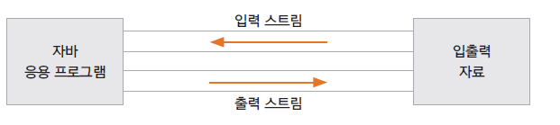
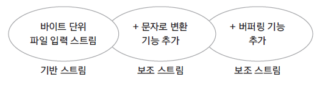
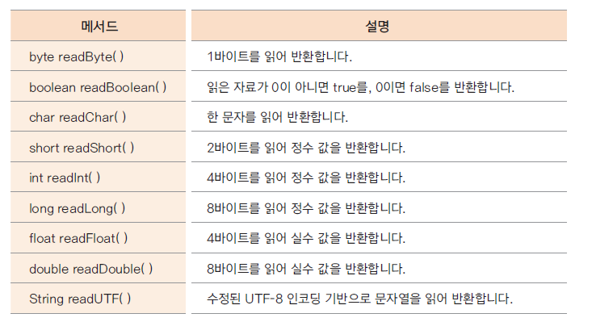
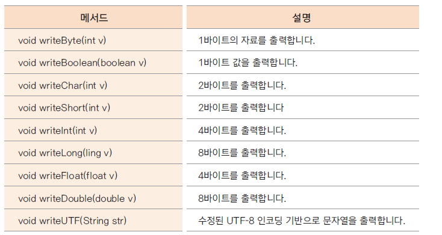

# 자바 입출력을 위한 I/O 스트림

### 입출력 스트림
* 자바는 다양한 입출력 장치에 독립적으로 일관성이 있는 입출력을 입출력 스트림을 통해 제공
* 입출력이 구현되는 곳: 파일 디스크, 키보드, 마우스, 네트웍, 메모리 등 모든 자료가 입력되고 출력되는 곳

### 입출력 스트림 구분
* 대상 기준: 입출력 스트림
* 자료 종류: 바이트 스트림 / 문자 스트림
* 기능: 기반 스트림 / 보조 스트림

### 입출력 스트림
* 입력 스트림 : 대상으로부터 자료를 읽어 들이는 스트림
* 출력 스트림 : 대상으로 자료를 출력하는 스트림
  
  

* 스트림 종류

| 종류 | 예시 |
| --- | --- |
| 입력 스트림 | FileInputStream, FileReader, BufferedInputStream, BufferedReader 등 |
| 출력 스트림 | FileOutputStream, FileWriter, BufferedOutputStream, BufferedWriter 등 |

### 바이트 단위 스트림, 문자 단위 스트림
* 바이트 단위 스트림 : 동영상, 음악 파일, 실행 파일등의 자료를 읽고 쓸 때 사용
* 문자 단위 스트림 : 바이트 단위로 자료를 처리하면 문자는 깨짐, 인코딩에 맞게 2바이트 이상으로 처리하도록 구현된 스트림
* 스트림 종류

| 종류      | 예시 |
|---------| --- |
| 바이트 스트림 | FileInputStream, FileOutputStream, BufferedInputStream, BufferedOutputStream 등 |
| 문자 스트림  | FileReader, FileWriter, BufferedReader, BufferedWriter 등 |

#### 바이트 단위 입출력 스트림
* InputStream
  * 주요 하위 클래스
    * FileInputStream: 파일에서 바이트 단위로 자료를 읽는다.
    * ByteArrayInputStream: byte 배열 메모리에서 바이트 단위로 자료를 읽는다.
    * FilterInputStream: 기반 스트림에서 자료를 읽을 때 추가 기능을 제공하는 보조 스트림의 상위 클래스
  * 주요 메서드
    * int read(): 입력 스트림으로부터 한 바이트의 자료를 읽는다. 읽은 자료의 바이트 수를 반환
    * int read(byte b[]): 입력 스트림으로부터 b[] 크기의 자료를 b[]에 읽는다. 읽은 자료의 바이트 수를 반환
    * int read(byte b[], int off, int len): 입력 스트림으로부터 b[] 크기의 자료를 b[]의 off 변수 위치부터 저장하여 len 만큼 읽는다. 읽은 자료의 바이트 수를 반환
    * void close(): 입력 스트림과 연결된 대상 리소스를 닫는다.
* OutputStream
  * 주요 하위 클래스
    * FileOutputStream: 파일에서 바이트 단위로 자료를 쓴다.
    * ByteArrayOutputStream: byte 배열 메모리에서 바이트 단위로 자료를 쓴다.
    * FilterOutputStream: 기반 스트림에서 자료를 쓸 때 추가 기능을 제공하는 보조 스트림의 상위 클래스
  * 주요 메서드
    * int write(): 한 바이트 출력
    * int write(byte b[]): b[] 크기의 자료를 출력
    * int write(byte b[], int off, int len): b[] 배열에 있는 자료의 off 위치부터 len 개수만큼 자료를 출력
    * void flush(): 출력을 위해 잠시 자료가 머무르는 출력 버퍼를 강제로 비워 자료를 출력
    * void close(): 출력 스트림과 연결된 대상 리소스를 닫는다. 출력 버퍼가 지워짐
      * 출력 버퍼를 지울 때 flush() 메서드 사용
      * close() 메서드 내부에서 flush()가 호출되므로 close() 메서드가 호출되면 출력 버퍼가 비워짐

#### 문자 단위 입출력 스트림
* Reader
  * 주요 하위 클래스
    * FileReader: 파일에서 문자 단위로 읽는 스트림 클래스
    * InputStreamReader: 바이트 단위로 읽은 자료를 문자로 변환해주는 보조 스트림 클래스
    * BufferedReader: 문자로 읽을 때 배열을 제공하여 한꺼번에 읽을 수 있는 기능을 제공하는 보조 스트림
  * 주요 메서드
    * int read(): 파일에서 문자 단위로 읽는 스트림 클래스
    * int read(char[] buf): 파일로부터 buf 배열에 문자를 읽는다.
    * int read(char[] buf, int off, int len): 파일로부터 buf 배열의 off 위치로부터 len 개수만큼의 문자로 읽는다.
    * void close(): 입력 스트림과 연결된 대상 리소스를 닫음
* Writer
  * 주요 하위 클래스
    * FileWriter: 파일에서 문자 단위로 출력하는 스트림 클래스
    * OutputStreamWriter: 바이트 단위의 자료를 문자로 변환해 출력해주는 보조 스트림 클래스
    * BufferedWriter: 문자로 쓸 때 배열을 제공하여 한꺼번에 쓸 수 있는 기능을 제공하는 보조 스트림
  * 주요 메서드
    * int write(int c)
    * int write(char[] buf)
    * int write(char[] buf, inf off, int len)
    * int write(String str)
    * int write(String str, inf off, int len)
    * int flush(): 출력하기 전 자료 있는 공간(출력 버퍼)을 비워 출력하도록 함
    * void close(): 스트림과 연결된 리소를 닫음. 출력 버퍼 지워짐

### 기반 스트림과 보조 스트림
* 기반 스트림: 대상에 직접 자료를 읽고 쓰는 기능의 스트림
* 보조 스트림: 직접 읽고 쓰는 기능은 없이 추가적인 기능을 더해주는 스트림
* 보조 스트림은 직접 읽고 쓰는 기능은 없으므로 항상 기반 스트림이나 또 다른 보조 스트림을 생성자의 매개 변수로 포함함

* 스트림 종류

| 종류     | 예시 |
|--------| --- |
| 기반 스트림 | FileInputStream, FileOutputStream, FileReader, FileWriter 등 |
| 보조 스트림 | InputStreamReader, OutputStreamWriter, BufferedInputStream, BufferedOutputStream 등 |

#### 보조 스트림
* FilterInputStream과 FilterOutputStream: 보조 스트림의 상위 클래스들
* 생성자의 매개변수로 또 다른 스트림(기반 스트림이나 다른 보조 스트림)을 가짐
* Decorator Pattern(데코레이터 패턴)으로 구현
* 상위 클래스 생성자
  * protected FilterInputStream(InputStream in): 생성자의 매개변수로 InputStream을 받음
  * public FilterOutputStream(OutputStream out): 생성자의 매개변수로 OutputStream을 받음
    
  

* InputStreamReader와 OutputStreamWriter
  * 바이트 단위로 읽거나 쓰는 자료를 문자로 변환해주는 보조 스트림
* BufferedInputStream과 BufferedOutputstream
  * 약 8k의 배열이 제공, 입출력이 빠르게 하는 기능이 제공되는 보조 스트림
  * BufferedReader와 BuffredWriter는 문자용 입출력 보조 스트림
* DataInputStream과 DataOutputStream
  * 자료가 메모리에 저장된 상태, 그대로 읽거나 쓰는 스트림
  * DataInputStream 메서드
    
  
  * DataOutputStream 메서드
    
  

### 그 외 입출력 클래스들
* File 클래스
  * 파일 개념을 추상화한 클래스
  * 입출력 기능은 없고, 파일 이름, 경로, 읽기 전용 등의 속성을 알 수 있음
* RandomAccessFile 클래스
  * 입출력 클래스 중 유일하게 파일에 대한 입력과 출력을 동시에 할 수 있는 클래스
  * 파일 포인터가 있어서 읽고 쓰는 위치의 이동이 가능