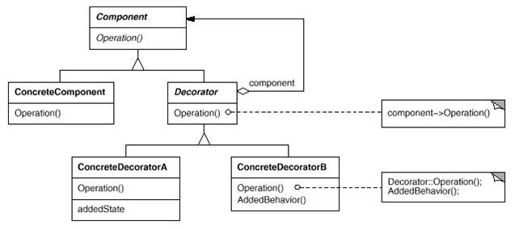

# 09. 데코레이터 패턴

### Decorator Pattern
* 자바의 입출력 스트림은 decorator pattern
* 여러 decorator 들을 활용하여 다양한 기능을 제공
* 상속보다 유연한 구현 방식
* 데코레이터는 다른 데코레이터나 또는 컴포넌트를 포함해야 함
* 객체의 결합을 통해 기능을 동적으로 유연하게 확장 가능
  * 지속적인 기능의 추가와 제거가 용이
  * 기본 기능에 추가할 수 있는 기능의 종류가 많은 경우 각 추가 기능을 Decorator 클래스로 정의한 후 필요한 Decorator 객체를 조합함으로써 추가 기능의 조합을 설계하는 방식
* decorator와 componenet는 동일한 것이 아님(기반 스트림 클래스가 직접 읽고 쓸 수 있음, 보조 스트림은 추가적인 기능 제공)
* 구조(Structual) 패턴 중 하나
  * 클래스나 객체를 조합해 더 큰 구조를 만드는 패턴
  * ex) 
    * 서로 다른 인터페이스를 지닌 2개의 객체를 묶어 단일 인터페이스를 제공
    * 객체들을 서로 묶어 새로운 기능을 제공

* Component
  * 기본 기능을 뜻하는 ConcreteComponent와 추가 기능을 뜻하는 Decorator의 공통 기능을 정의
  * 즉, 클라이언트는 Component를 통해 실제 객체를 사용
* ConcreteComponent
  * 기본 기능을 구현하는 클래스
* Decorator
  * 많은 수가 존재하는 구체적인 Decorator의 공통 기능을 제공
* ConcreteDecoratorA, ConcreteDecoratorB
  * Decorator의 하위 클래스로 기본 기능에 추가되는 개별적인 기능을 뜻함
  * ConcreteDecorator 클래스는 ConcreteComponent 객체에 대한 참조가 필요
    * 이는 Decorator 클래스에서 Component 클래스로의 '합성(Composition) 관계'를 통해 표현 됨
    * 합성 관계
      * 생성자에서 필드에 대한 객체를 생성하는 경우
      * 전체 객체의 라이프타임과 부분 객체의 라이프 타임은 의존적이다.
      * 즉, 전체 객체가 없어지면 부분 객체도 없어짐.

#### 예시 - 데코레이터 패턴을 활용하여 커피 머신
<pre>
Decorator Pattern을 활용하여 커피를 만들어 봅시다.

아메리카노
카페 라떼 = 아메리카노 + 우유
모카 커피 = 아메리카노 + 우유 + 모카시럽
크림 올라간 모카커피 = 아메리카노 + 우유 + 모카시럽 + whipping cream

커피는 컴포넌트고, 우유, 모카시럽, whipping cream은 모두 데코레이터임
</pre>